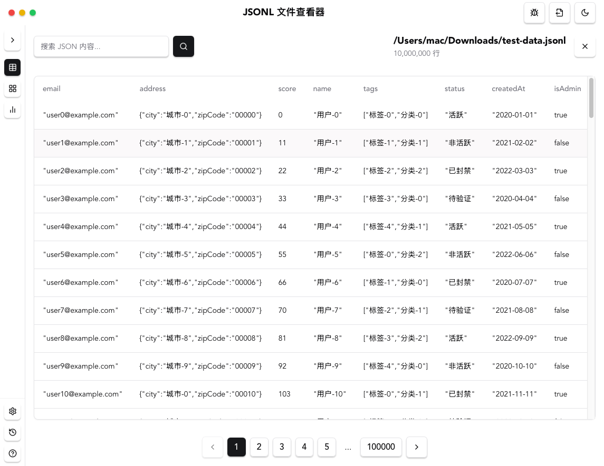
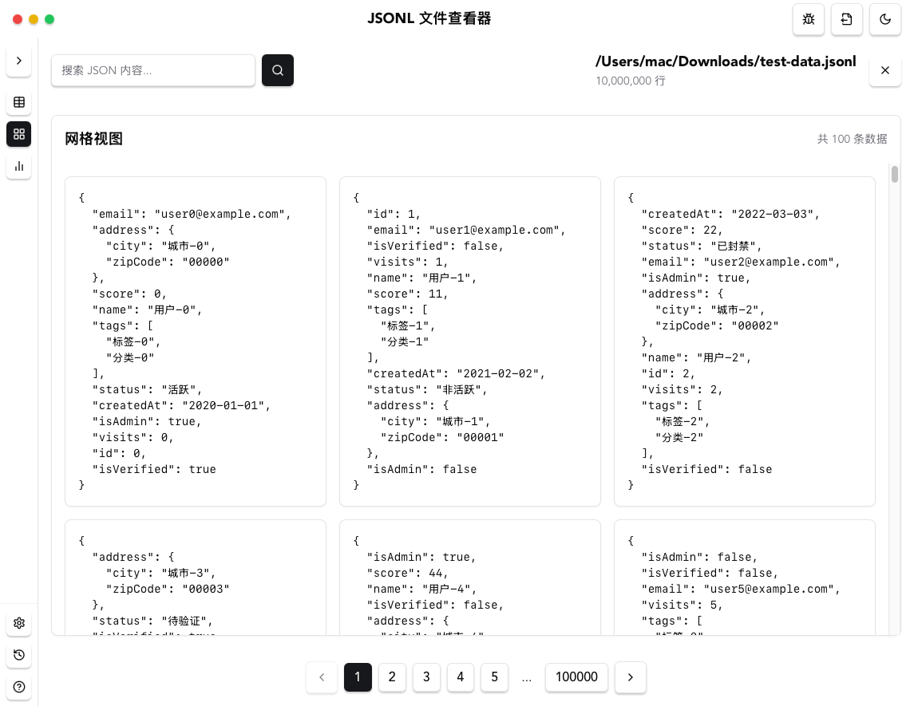

# Smart Slice

<div align="center">
  
</div>

<p align="center">
  <a href="https://github.com/ca-gee/smart-slice/stargazers">
    
  </a>
  <a href="https://github.com/ca-gee/smart-slice/issues">
    
  </a>
  <a href="https://github.com/ca-gee/smart-slice/blob/main/LICENSE">
    
  </a>
  <a href="https://tauri.app/">
    
  </a>
  <a href="https://reactjs.org/">
    
  </a>
  <a href="https://www.typescriptlang.org/">
    
  </a>
  <a href="https://tailwindcss.com/">
    
  </a>
</p>

一个基于 Tauri + React 的 JSONL 文件查看器，提供表格、网格和图表三种视图模式。

## 功能特性

<div align="center">
  
  <p>主界面</p>
  
  
  <p>表格视图</p>
  
  
  <p>网格视图</p>
</div>

- 📊 多种视图模式
  - 表格视图：支持固定列宽、水平滚动
  - 网格视图：卡片式布局，支持 JSON 格式化显示
  - 图表视图：待实现
- 🔍 搜索功能
  - 支持 JSON 内容搜索
  - 实时过滤显示
- 📂 文件操作
  - 打开 JSONL 文件
  - 生成测试数据
  - 调试模式
- 🎨 界面特性
  - 响应式布局
  - 暗色模式支持
  - 可折叠侧边栏
  - 自定义滚动条样式

## 开发路线图

### 1. 📝 分页与懒加载 ✅
- 支持设定每页条数（如 20、50、100）
- 大文件逐行读取时，仅渲染当前页，提升性能
- 加入跳页、上一页/下一页功能

### 2. ✏️ 数据编辑与可视化
- 在 UI 中直接修改单行 JSON 字段值
- 提供 JSON Viewer（如树状结构或表格结构切换）
- 支持字段增删（右键操作或按钮）

### 3. 🧹 数据清洗工具
- 快速检测：字段缺失、高频重复内容
- 批量操作：
  - 清理特殊字符（如空格、换行、HTML标签）
  - 限制 prompt / completion 长度
  - 字段校验规则（如 prompt 字段不能为空）

### 4. 📁 数据导出功能
- 导出为新的 JSONL 文件（可筛选条件后导出）
- 选中行 → 导出 / 拆分 /保存为新数据集
- 支持"保存当前操作结果为草稿"

### 5. 🧠 辅助标注或增强（稍后阶段可集成）
- 接入 GPT API：自动补全 completion、风格润色
- 批量生成 prompt/completion 对
- 翻译功能接入（如调用 DeepL、Baidu 翻译等）

## 技术栈

- **前端框架**：React 18
- **UI 组件**：Radix UI + 自定义组件
- **样式**：Tailwind CSS
- **桌面应用**：Tauri 2.0
- **开发工具**：
  - TypeScript
  - Vite
  - ESLint
- **后端实现**：Rust

## 安装

1. 克隆项目
```bash
git clone https://github.com/ca-gee/smart-slice.git
cd smart-slice
```

2. 安装依赖
```bash
npm install
```

3. 开发模式运行
```bash
npm run tauri dev
```

4. 构建应用
```bash
npm run tauri build
```

## 使用说明

1. **打开文件**
   - 点击主界面的文件区域或使用快捷键打开 JSONL 文件
   - 支持拖拽文件到界面打开

2. **视图切换**
   - 使用侧边栏的视图切换按钮在表格、网格和图表视图之间切换
   - 侧边栏可以折叠以提供更大的显示空间

3. **搜索功能**
   - 在顶部搜索框输入关键词
   - 支持实时过滤显示匹配的内容

4. **调试模式**
   - 在标题栏切换调试模式
   - 可以生成测试数据用于功能测试

## 贡献

欢迎提交 Issue 和 Pull Request！

## 许可证

本项目采用 [MIT 许可证](LICENSE)。

### 许可证条款

MIT 许可证是一个宽松的开源许可证，允许：

- 商业使用
- 修改
- 分发
- 私人使用

唯一的限制是必须包含原始版权声明和许可证文本。

### 使用说明

使用本项目时，您需要：

1. 保留原始版权声明
2. 包含 MIT 许可证的完整文本
3. 在修改后的代码中注明变更

更多详细信息请参阅 [LICENSE](LICENSE) 文件。